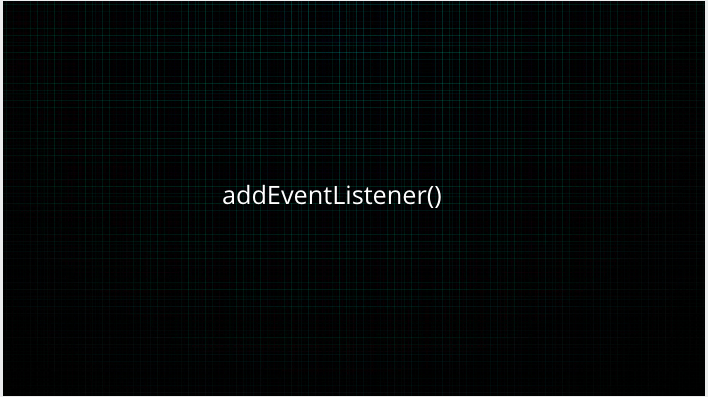
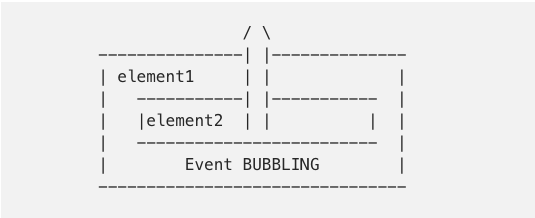
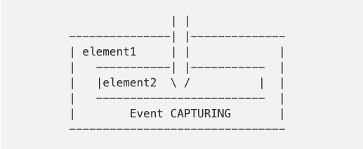
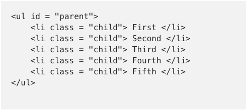

Since I am just starting out with writing blogs, I am going to follow Paul Graham’s advice on how to write:
http://www.paulgraham.com/talk.html



That said, in simple terms delegation means passing on a responsibility to manage an event or activity to someone.

Event is anything which changes the structure of the elements of the DOM at run-time. They can range from a simple mouse click to a more intuitive media event such as timeupdate.

You can find category wise list of events here: https://developer.mozilla.org/en-US/docs/Web/Events

To understand event delegation we need to be familiar with features of Javascript events: event bubbling, target elements and event handlers. So let’s have a quick look at these.

### How the flow of events is decided in JS?

There are two ways on how an event passes through the DOM: first is event bubbling and the other is event capturing.

When an event is triggered on an element, for example a keydown event in the browser window, the same event is also triggered on all of that element’s ancestors. This is known as event bubbling or propagation; the event bubbles up from the originating element to the top of the DOM tree. This has an outward flow.



Event capturing works opposite to this. The event triggers down from the top of the DOM tree and moves inwards to the element which called it. Invariably, this has an inward flow.



Next, let’s talk about event handlers now.

Handlers are basically the functions which execute when the event happens. Let’s break it down using the syntax:

`syntax: element.addEventListener(event, handler function, useCapture)
`

<b>element</b>: This is the HTML element to which you would like to assign an event, this is also referred as event target.

<b>addEventListener()</b>: this is an inbuilt function in JS which takes the event to listen for, and a second argument(listener) to be called whenever the mentioned event gets fired.

<b>event</b>: as already discussed, an event can be anything which would like to monitor or listen for in the DOM.

<b>handler function</b>: a function which responds at the time event occurs.

<b>useCapture</b>: this is a boolean parameter which has its default value set to false. A false value indicates event bubbling while true means event capturing.

We are now in position to discuss event delegation. Let’s use an example here. Say we have a ul parent element with several child elements in our HTML. We would want something to happen or trigger when each child is targeted. In this case, we can either attach an event listener to each child or simply assign a single event listener to the parent.

<!--  -->

```html
<ul id = "parent"> 
    <li class = "child"> First </li>
    <li class = "child"> Second </li>
    <li class = "child"> Third </li>
    <li class = "child"> Fourth </li>
    <li class = "child"> Fifth </li>
</ul>
```

This is where event delegation comes in. It can optimise the performance of our web-applications when responding to user events. Event delegation works because of event propagation or bubbling which we discussed above.

We will write two excerpt of the code: one without involving delegation and other one using it.

```js
const children = Array.from(document.getElementByClassName('child'));
children.forEach(child => {
   child.addEventListener('click', () => console.log(inner.HTML));
});

```

Here we have applied event listener to each of our child elements. The above code can be written as follows using the event delegation method.

```js
const parent = document.getElementbyId('parent');
parent.addEventListener('click', e => {
    if (e.target.className === 'child') {
     console.log(e.target.innerHTML);
    }
});

```
Here <i>e.target</i> is the clicked element. This is achieved by adding an event listener only to the parent element ul.

The advantage of delegation method comes in when we have multiple child elements which we want to hear for events. However, in case the target element is deeply nested in the DOM, it may not be wise to apply event delegation since the event propagation can take a lot of time and have performance issues.

That would be all in this post. I would be glad to know if you found this informative. Thanks for reading!

PS: Credit where it’s due. Thanks to quirksmode for the figures!
