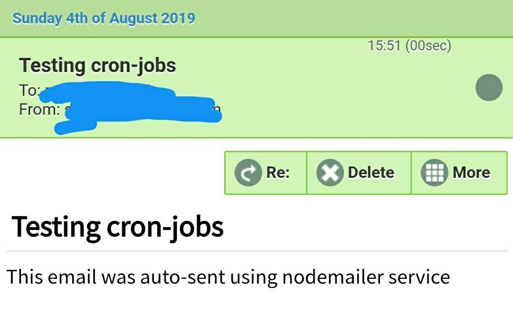

Simply put, a *cron* is a job scheduler which appoints a command or script on your server to run automatically at a specified date and time. It's mainly used in software environments where a task needs to be performed at repetitive intervals. Some popular use cases for this are: automating system maintenance tasks, backing up database at a specified time, etc.

To get started we need to have [Node](https://nodejs.org/) and [NPM](https://www.npmjs.com/) installed on the system:

First, we will start a new Node application by running:

```shell
mkdir test-cron-jobs && cd test-cron-jobs
npm init -y

```

Next, we would need application dependencies to be installed:

```shell
npm install express node-cron fs nodemailer

```
- express: allows to start a webserver
- [node-cron](https://www.npmjs.com/package/node-cron): task scheduler in JavaScript for NodeJS
- fs: filesystem module in NodeJs
- [nodemailer](https://www.nodemailer.com/): module for NodeJs to send emails

To start the server we will create an entry file *index.js* inside the *test-cron-job* directory we set up earlier.

```shell
touch index.js
```

Once the file is created we can add this code: 

```js
const cron = require('node-cron');
const express = require('express');
const fs = require('fs');
const nodemailer = require('nodemailer');

app = express();

app.listen(8000);
```


If you're familiar with Node, you'll understand that we are importing the packages to our *index.js* file for usage and running the webserver. Next, let's schedule a task using *cron-job* to create a newfile and delete it after a specific interval.

```js
app = express()

//  create a file on the server every 10 seconds
cron.schedule('*/10 * * * * *', () => {
  console.log('creating a file every 10 seconds');
  fs.writeFile('testfile.txt', 'Learn Node FS module', (err) => {
    if (err) throw err;
    console.log('File is created successfully.');
  }); 

[...]
```

```js
// task to remove a file from the server
cron.schedule('*/12 * * * * *', () => {
  console.log('deleting a file every 12 seconds');
  fs.unlink('testfile.txt', (err) => {
    if (err) throw err;
    console.log('File is deleted successfully.');
  }); 
})

app.listen(8000)
```

Before we jump and execute this by starting the server, let's understand what's happening.
The asteriks in the ``` cron.schedule ``` takes in time interval in the format described here:

```markdown
# ┌────────────── second (optional)
 # │ ┌──────────── minute
 # │ │ ┌────────── hour
 # │ │ │ ┌──────── day of month
 # │ │ │ │ ┌────── month
 # │ │ │ │ │ ┌──── day of week
 # │ │ │ │ │ │
 # │ │ │ │ │ │
 # * * * * * *

```

Say, if a cron-job needs to be executed at every hour, setting the minute field to *0* will run the job at the start of an hour.

```js
cron.schedule('0 * * * *', () => {
    // code goes here
});

```

Let's go back to terminal and execute

```shell
node index.js

```

We will notice that a new file is created with *testfile.txt* and gets deletd as per our scheduled job interval. Simple enough? Let's take another use case of this and try implementing it with nodemailer.

With [nodemailer](https://www.nodemailer.com/), we need to create a mail transporter first.

```js
create mail transporter
let transporter = nodemailer.createTransport({
  service: "gmail",
  auth:{
    user: "youremail@gmail.com",
    pass: "yourpassword"
  }
});

```
---
**Note:**
 For this to work properly you will have to *turn on* the access of less secure app to your Gmail account [here](https://myaccount.google.com/security?pmr=1)
 ___


Now, we can schedule our email message to the desired recipient as show below:

```js
cron.schedule('* * * * *', () =>{
  console.log('sending email using cron job');
  let mailOptions = {
    from: "youremail@gmail.com",
    to: 'recipient-email@xyz.com',
    subject: `Testing cron-jobs`,
    text: `This email was auto-sent using nodemailer service!`
  };

  transporter.sendMail(mailOptions, (err, info) => {
    if(err){
      throw err;
    } else{
      console.log('Email sent successfully!')
    }
  })
})

```
Fire up your terminal for one last time and run<br />
``` js
node index.js 

```

Wait for the interval you have defined above(in our case it's at the start of every minute), and email should get delivered to the specified recipient.

Here's a screenshot of the email I received:



