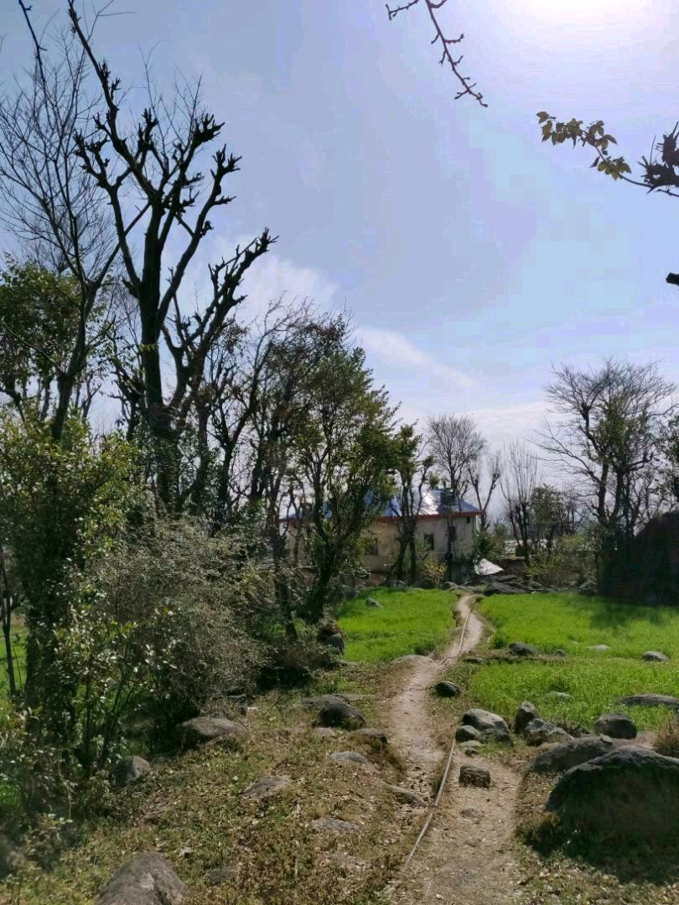

<i>(Most part of this post was written in early February, since then it's been sitting in my drafts)</i>

> How does one make a decision when presented by the dilemma: to explore or exploit?

A few years back when I first started being outdoors, it was easy for me to form an opinion that living in the mountains or, more amidst nature is something I would be doing more of in the days to come. Though looking back at it now it would be fair to say that I was more in love with the 'concept' of doing it than 'doing' itself. Well, this time it wasn't exactly the same but until a few months back, it never occurred to me that something along these lines would come up again with [AltCampus](https://altcampus.io).

One of the deciding factors for me to be a part of this program was the location setting. I have always been fond of the slow, nonchalant lifestyle of the people in the hills. Since my time working a desk job in the corporate I have had the itch to get away from the hustle of city life and gladly I get to scratch it now :P 

The other side of this was the curiosity to move and see what's on the developer side of things, understand how a product scales and learn to build one.

It's been a month I have been trying to write describing my days here in Rakkar. My time here so far reminds me of something a friend once said:

> Such a rush, to do nothing at all.

This is different from the time when I was backpacking on a shoe-string budget in 2016. Those were the days to quench the wanderlust in me, though the thirst hasn't died down yet, I would say my time here is more with a purpose. Our decisions are somewhere more subjective than we credit them to be. They are influenced by one's opinions, beliefs, perspective and of course personal feelings. For some it acts as a catalyst. I know people who prefer to follow a more objective approach to doing things by keeping their emotions aside from their decision making. But for me, this has never seemed to work. There can be many argument in favor of this but the one which seems more plausible is allowing yourself to expand your so-called 'comfort zone'. By this, you are no longer confined to a single entity or the same mindset. 

### Thoughts on a thriving-community space

Any community environment thrives on acts of volunteerism and I notice this in the space around me so often. The clear upside of a community-driven place that I can think of now is that it gives you enough space to shed your inhibitions, test and re-asses your beliefs and form networks. Being in a set up such as this builds values in individuals and teach you a thing or two about transparency.

A few core things which resonates with the community setup here:
+ Open-handedness: Giving away your resources, time, ideas to the people is the best way to earn their attention.
+ Accountability: Taking ownership for one's actions and being responsible to fix things up.
+ Social space: Allowing an individual enough space and time to figure things out. Or, in other words not being too rigid with the community skeleton.

All this comes down to adding values and helping people grow together.

<!-- ( *But, there are some pitfalls of such spaces which I would like to talk in another post* ) -->

### Take-aways

- <u>Learning how to learn</u>: This wasn't an alien concept to me before coming to AltCampus but I never had a real chance to put this into practice. Taking initiatives with your own learning is something that makes you grow as an individual. If you can teach someone how to self-learn, you teach them for life.

- <u>Acquiring specific skills</u>: I have come to believe 'specific-skills' is what separates *good* from a <i>great</i> resource in any industry. There are only a few variables in any environment that drive the change, rest are just constants. 

- <u>Thinking in moderate</u>: All-or-nothing approach keeps you from doing what you can every day. Or as [Naval](https://twitter.com/@naval) said it: "All the returns in life, whether in wealth, relationships, or knowledge, come from compound interest."

***

It's easier to learn when you show-up with few expectations. Being introduced to the software development setup formally where now I stand a chance to make contributions.

