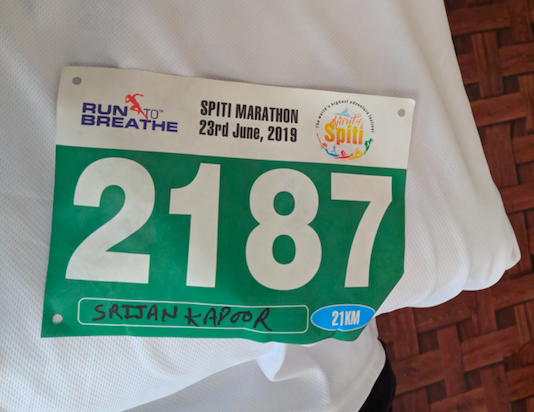

I have been an infrequent runner. Never had I been able to keep up a running streak for more than 3 days. More so, until a couple of months back I wasn't even aware of the *concept* of running, meaning how the motion of your hips and arms dictate your run. 

I hardly thought of running as something I could cultivate on.

This year on June 23rd, I participated in [Run to Breathe - Spiti Marathon](https://events.indiarunning.com/Event/Details/SpitiHalfMarathon/2395) and I want to use this space to talk about things leading up to it.

A key to seeing improvement is to keep track of things. Be it habits, triggers, sleep et al., something which is not really talked about as much. This is something I learned earlier in the year and it led me to start maintaining a track of my runs. I use [Nike Run Club](https://play.google.com/store/apps/details?id=com.nike.plusgps&hl=en_IN) and would highly recommend it to someone looking to get started. The audio-guided runs category on the app is beautifully curated for a beginner and the voiceover by Coach Bennet will make sure you almost cheer yourself to the finish line.

Some excerpts from what I noted down after completing my runs:

- The only thing you're sure before a run is if you have tied your shoe-laces. You cannot pre-meditate a run.

- When you are running miles, it's the momentum that's guiding your run. You may be tired but the inertia keeps you moving.

- It's gradual progress. During a run, you have to be faster, NOT fast, smarter NOT smart from your previous self. 

- Be honest when answering, *how do you feel about this run?*

- Duration over distance. Instead of wondering how much you can cover, think how long you can go.

- What you eat and how long before a run you eat, matters.

Most of my runs were done around the altitude of <1200m. However, high altitude(>3000m) running is a different game. The advantage of 12-15 degrees weather at high altitude gets compensated by the amount of oxygen getting to your muscles. Low atmospheric pressure in the thin air makes the bloodless oxygen-rich as it travels to the muscles.

The whole idea of the marathon was to have an experience which would allow me to turn running into a habit. Here's to hoping this happens!

